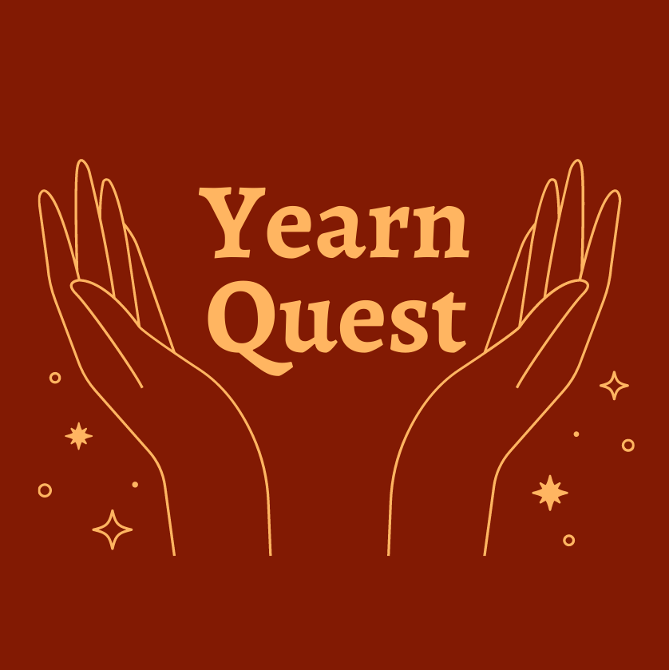

<div id="top"></div>

Hackathon Submission - [here](https://devpost.com/software/yearnquest)

<!-- PROJECT LOGO -->
<br />
<div align="center">
  <a href="https://github.com/RakeshPotnuru/YearnQuest">
    
  </a>

<h3 align="center">Yearn Quest</h3>

  <p align="center">
    Let's end the Hunger ✊
    <br />
    <!-- <a href="https://github.com/RakeshPotnuru/YearnQuest"><strong>Explore the docs »</strong></a> -->
    <br />
    <br />
    <a href="https://yearn-quest.herokuapp.com/">View Demo</a>
    ·
    <a href="https://github.com/RakeshPotnuru/YearnQuest/issues">Report Bug</a>
<!--     ·
    <a href="https://github.com/RakeshPotnuru/YearnQuest/issues">Request Feature</a> -->
  </p>
</div>

<!-- TABLE OF CONTENTS -->
<details>
  <summary>Table of Contents</summary>
  <ol>
    <li>
      <a href="#about-the-project">About The Project</a>
      <ul>
        <li><a href="#built-with">Built With</a></li>
      </ul>
    </li>
    <li>
      <a href="#getting-started">Getting Started</a>
      <ul>
        <li><a href="#prerequisites">Prerequisites</a></li>
        <li><a href="#installation">Installation</a></li>
      </ul>
    </li>
    <!-- <li><a href="#usage">Usage</a></li> -->
    <!-- <li><a href="#roadmap">Roadmap</a></li> -->
    <!-- <li><a href="#contributing">Contributing</a></li> -->
    <li><a href="#license">License</a></li>
    <li><a href="#contact">Contact</a></li>
    <!-- <li><a href="#acknowledgments">Acknowledgments</a></li> -->
  </ol>
</details>

<!-- ABOUT THE PROJECT -->

## About The Project

[![Yearn Quest][product-screenshot]](https://example.com)

<p align="right">(<a href="#top">back to top</a>)</p>

### Built With

- [Bootstrap](https://getbootstrap.com)
- [JQuery](https://jquery.com)
- [Ejs](https://ejs.co)
- [NodeJs](https://nodejs.org)
- [Sawo API](https://sawolabs.com)
- [Twilio sendgrid](https://sendgrid.com)

<p align="right">(<a href="#top">back to top</a>)</p>

<!-- GETTING STARTED -->

## Getting Started

To get a local copy up and running follow these simple example steps.

### Prerequisites

- npm

  ```sh
  npm install npm@latest -g
  ```

- You need [Sawo](https://sawolabs.com) and Twilio [SendGrid](https://sendgrid.com) API keys for this project.

### Installation and Setup

1. Clone the repo

   ```sh
   git clone https://github.com/RakeshPotnuru/YearnQuest.git
   ```

2. Install NPM packages

   ```sh
   npm install
   ```

3. Create `nodemon.json` file in the `/root` directory

   ```
   {
      "env": {
        "DB_URL": "mongodb://localhost:27017/databaseName"
        "SENDGRID_API_KEY" : "Sendgrid API key"
        "SENDER_EMAIL": "Sender email"
       }
    }
   ```

4. Create a `config.js` file at `public/js/` and add Sawo api key

  ```
  const keys = {
    SAWO_API_KEY: "Sawo api key",
  };
  ```

4. To start the server

   ```
   npm run dev
   ```

<p align="right">(<a href="#top">back to top</a>)</p>

<!-- LICENSE -->

## License

Distributed under the MIT License. See `LICENSE.txt` for more information.

<p align="right">(<a href="#top">back to top</a>)</p>

<!-- CONTACT -->

## Contact

- Rakesh - [@RakeshPotnuru](https://github.com/RakeshPotnuru)
- Rwitesh Bera - [@rwiteshbera](https://github.com/rwiteshbera)
- Aqsa Shadab Khan - [@aqsak1](https://github.com/aqsak1)

Project Link: [YearnQuest](https://github.com/RakeshPotnuru/YearnQuest)

<p align="right">(<a href="#top">back to top</a>)</p>

<!-- ACKNOWLEDGMENTS -->

<!-- ## Acknowledgments

- []()
- []()
- []()

<p align="right">(<a href="#top">back to top</a>)</p> -->

<!-- MARKDOWN LINKS & IMAGES -->
<!-- https://www.markdownguide.org/basic-syntax/#reference-style-links -->

[contributors-shield]: https://img.shields.io/github/contributors/RakeshPotnuru/YearnQuest.svg?style=for-the-badge
[contributors-url]: https://github.com/RakeshPotnuru/YearnQuest/graphs/contributors
[forks-shield]: https://img.shields.io/github/forks/RakeshPotnuru/YearnQuest.svg?style=for-the-badge
[forks-url]: https://github.com/RakeshPotnuru/YearnQuest/network/members
[stars-shield]: https://img.shields.io/github/stars/RakeshPotnuru/YearnQuest.svg?style=for-the-badge
[stars-url]: https://github.com/RakeshPotnuru/YearnQuest/stargazers
[issues-shield]: https://img.shields.io/github/issues/RakeshPotnuru/YearnQuest.svg?style=for-the-badge
[issues-url]: https://github.com/RakeshPotnuru/YearnQuest/issues
[license-shield]: https://img.shields.io/github/license/RakeshPotnuru/YearnQuest.svg?style=for-the-badge
[license-url]: https://github.com/RakeshPotnuru/YearnQuest/blob/master/LICENSE.txt
[linkedin-shield]: https://img.shields.io/badge/-LinkedIn-black.svg?style=for-the-badge&logo=linkedin&colorB=555
[linkedin-url]: https://linkedin.com/in/linkedin_username
[product-screenshot]: public/images/homePage.png
